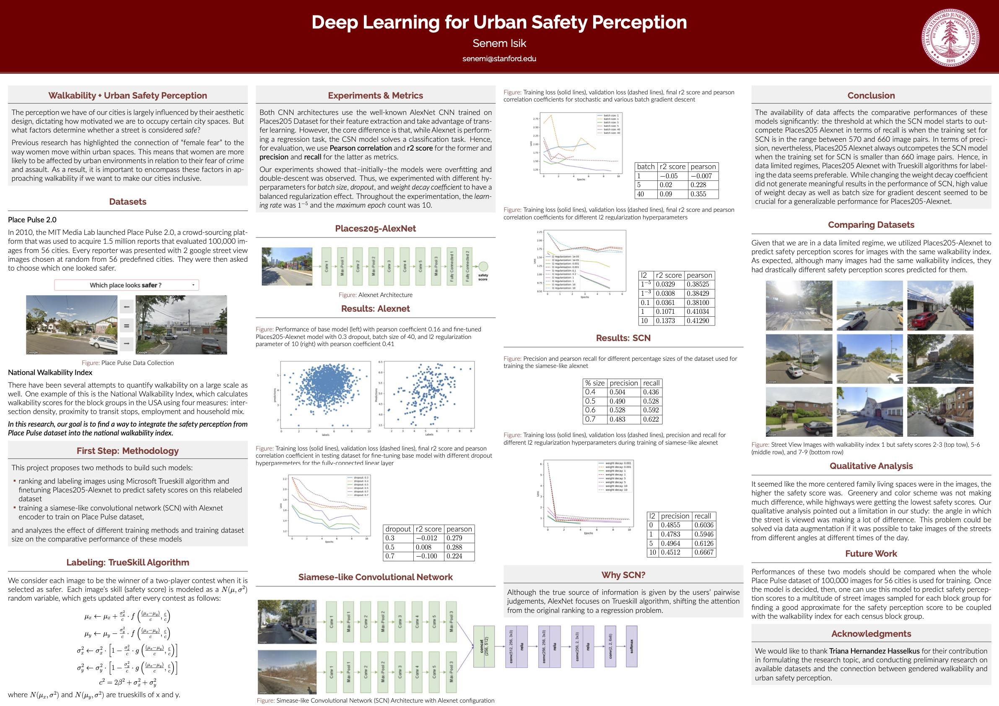

# Deep-Learning-for-Urban-Perception

This project proposes two methods to build models that can predict safety scores for locations outside of those covered in Place Pulse dataset: 
(1) ranking and labeling images using Microsoft Trueskill algorithm and finetuning Places205-Alexnet to predict safety scores on this relabeled dataset,
(2) training a siamese-like convolutional network (SCN) with Alexnet encoder to train on Place Pulse dataset, 
and analyzes the effect of different training methods and training dataset size on the comparative performance of these models.
For the detailed report, check https://drive.google.com/file/d/1YxNrOmM5kpj83-mZPism1IzUqdIWLjJ-/view?usp=share_link

